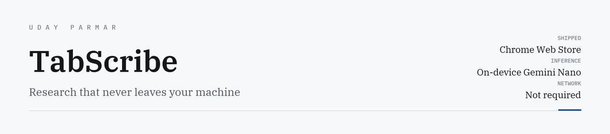
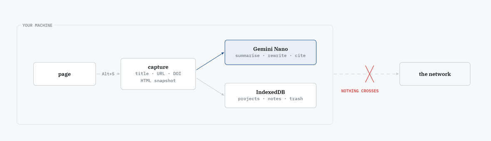

<picture>
  <source media="(prefers-color-scheme: dark)" srcset="assets/banner-dark.png">
  <source media="(prefers-color-scheme: light)" srcset="assets/banner-light.png">
  
</picture>

<p>
  <a href="https://chromewebstore.google.com/detail/tabscribe-%E2%80%94-research-os-f/adajfbbemhhjpgmiedkgbaceiiahgafd"></a>
  <a href="https://chromewebstore.google.com/detail/tabscribe-%E2%80%94-research-os-f/adajfbbemhhjpgmiedkgbaceiiahgafd"></a>
  <a href="https://chromewebstore.google.com/detail/tabscribe-%E2%80%94-research-os-f/adajfbbemhhjpgmiedkgbaceiiahgafd"></a>
  
  
</p>

Capture web snippets, turn them into structured research drafts, and cite them — summarising,
rewriting, translating and proofreading **entirely on your machine** through Chrome's built-in
Gemini Nano. It works with the network off.

---

## Why on-device

Every AI research tool worth using uploads your reading to someone else's server. If you are
working through unpublished results, confidential filings, or anything under embargo, that is
not a privacy preference — it is the reason you cannot use the tool at all.

<picture>
  <source media="(prefers-color-scheme: dark)" srcset="assets/boundary-dark.png">
  <source media="(prefers-color-scheme: light)" srcset="assets/boundary-light.png">
  
</picture>

The dashed edge is the whole product. Everything else follows from it.

## What it does

**Capture** — right-click or `Alt+S`. Extracts title, URL, favicon and DOI automatically, and
stores an **HTML snapshot of the source**, so a quote stays traceable after the page changes
underneath it.

**Process** — Chrome's built-in AI APIs, all local:

| | |
|---|---|
| **Summarizer** | Concise, academic-style summaries |
| **Rewriter** | Tone presets — concise, academic, friendly, executive |
| **Proofreader** | Grammar and style |
| **Translator** | Multilingual with auto-detection |
| **Writer** | Full drafts from collected snippets |

**Organise** — multiple projects, full-text search across every note, and trash-with-restore.
Research tools that delete permanently do not get used twice.

**Cite** — APA, MLA, Harvard and BibTeX, generated from metadata already captured rather than
re-entered by hand.

## The interesting constraint

Gemini Nano is not a frontier model. The product had to be designed around what a small
on-device model reliably does well — **bounded, single-document tasks** — instead of
pretending it could reason across a whole corpus. Every feature above is scoped to one
snippet or one note for that reason.

## Install

[**Chrome Web Store**](https://chromewebstore.google.com/detail/tabscribe-%E2%80%94-research-os-f/adajfbbemhhjpgmiedkgbaceiiahgafd)
· requires a Chrome version with built-in AI enabled.

Or load unpacked:

```bash
git clone https://github.com/Accidental-MVP/TabScribe.git
# chrome://extensions → Developer mode → Load unpacked
```

[Privacy policy](https://github.com/Accidental-MVP/tabscribe-privacy-policy)

---

<sub>Built by <a href="https://uday-parmar.vercel.app">Uday Parmar</a></sub>
